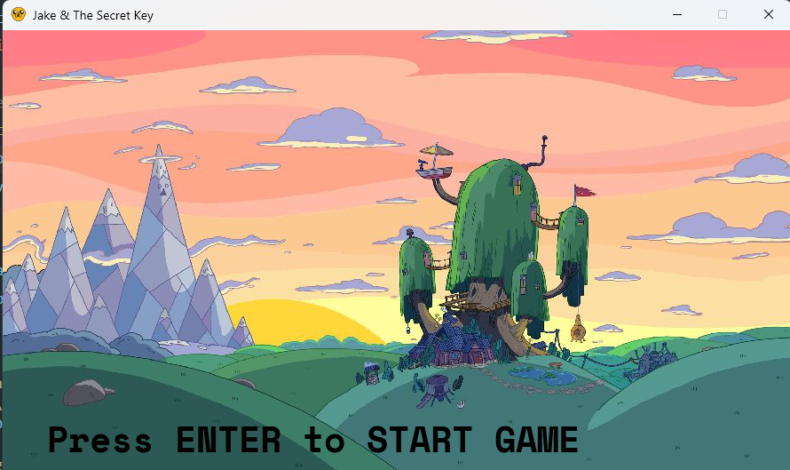
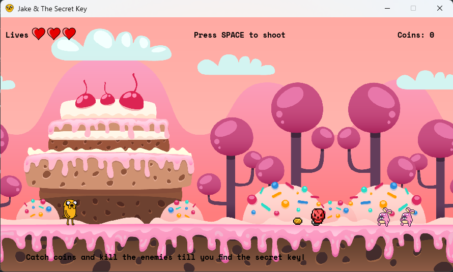
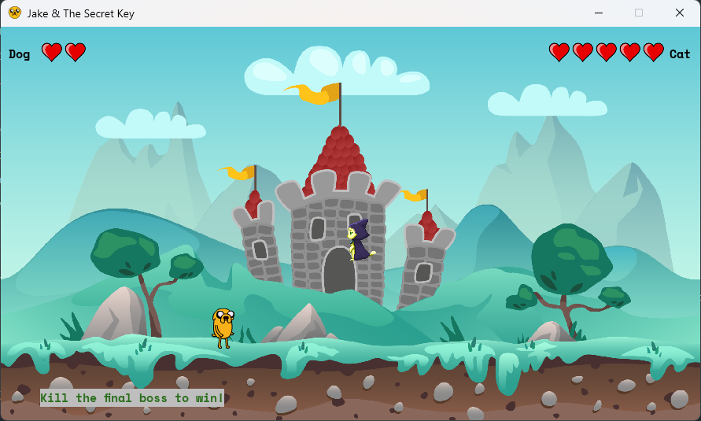

# 🗝️ Jake and the Secret Key
 
> *A candy-coated adventure with bullets, coins, and one very suspicious cat.*
 

 
A colorful 2D platformer built in Python with [Pygame](https://www.pygame.org/), developed as the **Final Project** for the **Advanced Python Programming Course** at IEFP in **August 2022**.
 
---
 
## 📸 Screenshots
 
### Level 1 — Candy World

 
### Boss Fight

 
---
 
## ✨ Features
 
- 🔫 **Shoot enemies** and dodge obstacles across candy-themed levels
- 🪙 **Collect coins** scattered throughout the world
- 🗝️ **Find the hidden key** to unlock the final chapter
- 🐱 **Boss Battle** against a mysterious feline adversary
- 🍭 **Adventure Time**-inspired aesthetic with classic platformer vibes
---
 
## 🚀 Getting Started
 
```bash
# Install dependency
pip install pygame
 
# Run the game
python main.py
```
 
---
 
## 🕹️ Controls
 
| Key | Action |
|---|---|
| `←` `→` Arrow Keys | Move |
| `↑` Arrow Key | Jump |
| `Space` | Shoot |
| `Enter` | Start game |
 
---
 
<p align="center">Made with ❤️ and way too much sugar 🍬</p>